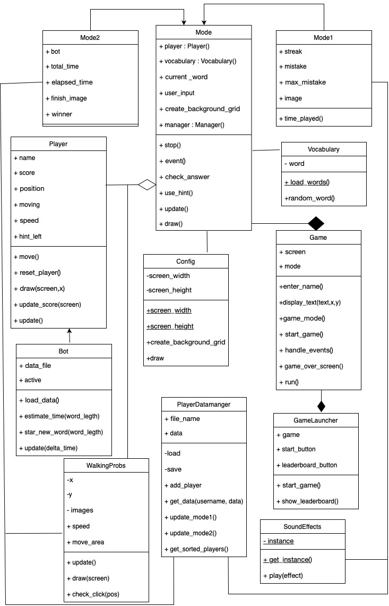

# Carproject2
Mode 1 : Player will play until they meet 3 loses.
Mode 2 : Each round has 3 minutes. Player have to play against a bot until one get 10 score.
If 3 minutes passed. The one who have most score will win.

This is a game where you are given definition, you have to correctly guess the word.

easter egg: There will be a hint giver randomly appear.If you click on them, you will get the hint.
The number of hint will stay with you if you play with the same username.
If you answer correctly for 4 time streak, you will get a bonus point and the score will be + 1 for each streak

below is uml class diagram

below is project proposal
[proposal](project_proposal.pdf)

youtube link 
https://youtu.be/c4er3xS9PkQ?si=_hzd1q5v7m7fphmi

additional class from the proposal 
1) PlayerDataManager
2) WalkingProb

additional data feature from the proposal
1) Collecting amount of player that play each mode. To know how many player play each mode	amount of player that play each mode represent in Pie chart
2) Presenting average time play per score. To know whether each score points are correlated to time played or not.	Time the total time of each round in mode1.	represent in Scatter plot
3) Collecting total count of each word length. To calculate the probability of each word length to appear	Collecting word length in each round represent in Histogram.